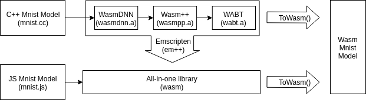

# WasmDNN

WasmDNN is a deep neural network library for generating machine learning models in WebAssembly. The library is
written in C++, but an alternative JavaScript/WebAssembly version is also available by compiling the project
using Emscripten.

## Architecture
### Pipeline

Above is an overview diagram of the WasmDNN library pipeline using an example model
designed to operate on the MNIST dataset.  To configure this model, one can either do this in C++ or in
WebAssembly using JavaScript bindings. In the C++ option, the model configuration is done using the WasmDNN
library. In the JavaScript bindings, the model configuration is done using the WebAssembly version
of the library compiled, together with Wasm++ and WABT, using Emscripten. Both model
configuration options are equivalent and should be capable of generating identical machine
learning Wasm model to train, test and predict on the MNIST dataset.

